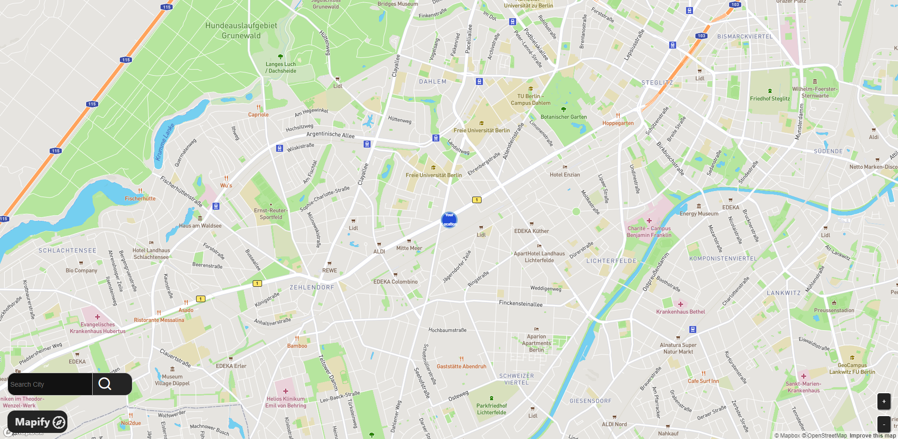

# EasyMapify

EasyMapify is a React-based interactive map application that utilizes Mapbox GL JS to provide a seamless mapping experience. The application allows users to view maps, search for cities, and interact with map elements such as markers. It includes features like dynamic marker sizing based on the map's zoom level, geolocation-based centering, and basic zoom controls.

## Table of Contents

- [Demo](#demo)
- [Features](#features)
- [Installation](#installation)
- [Usage](#usage)
- [Configuration](#configuration)
- [Project Structure](#project-structure)
- [Dependencies](#dependencies)
- [Contributing](#contributing)
- [License](#license)

## Demo

You can view a live demo of the application here: https://easymapify.netlify.app

## Features

- **Interactive Map**: Built using Mapbox GL JS, providing a responsive and interactive mapping experience.
- **Geolocation**: Automatically centers the map on the user's current location, with a fallback option.
- **Search Functionality**: Users can search for cities and have the map center on the searched location.
- **Custom Markers**: Dynamic marker creation based on searched locations with resizing functionality depending on the map's zoom level.
- **Zoom Controls**: Basic controls to zoom in and out on the map.

## Installation

To get a local copy of the project up and running, follow these steps:

### Prerequisites

- **Node.js**: Ensure that Node.js is installed on your machine.
- **NPM**: Node Package Manager comes with Node.js. Alternatively, you can use Yarn if you prefer.

### Steps

1. **Clone the repository**

   ```bash
   git clone https://github.com/keremsemiz/easymapify.git
2. **Navigate to the project directory**

    ```bash
    cd easymapify
3. **Install Dependencies**
    ```bash
    npm install
4. **Set up Mapbox access token**

 - You'll need to set up your Mapbox access token to use the Mapbox API. Create a .env file in the root of your project and add your token:

    ```bash
    REACT_APP_MAPBOX_ACCESS_TOKEN=your_mapbox_access_token
5. **Run the development server**
    ```bash
      npm run dev
- The application will be available at http://localhost:5173.

### Build for Production
To build the application for production:

    ```bash
      npm run build

This will create a dist directory with all the static files needed to serve your application.

## Usage
1. Geolocation: Upon loading, the map will try to center on your current location. If the geolocation fails, it will use a fallback location (e.g., Central Park, NYC).

2. Search for a City: Enter the name of a city in the search input. The map will center on the city if found and place a marker at that location.

3. Zoom Controls: Use the + and - buttons to zoom in and out on the map.

## Dependencies
- React: A JavaScript library for building user interfaces.
- Mapbox GL JS: A library for rendering interactive maps.
- Vite: A fast build tool for modern web projects, used to bundle the application.
- TypeScript: Adds static typing to JavaScript, improving code quality and developer experience.

## Contributing
Contributions are welcome! Please follow these steps to contribute:

1. Fork the repository: Create a new branch for your feature or bugfix.

2. Create your branch: git checkout -b feature/AmazingFeature or git checkout -b bugfix/FixBug.
3. Commit your changes: git commit -m 'Add some AmazingFeature'.
4. Push to the branch: git push origin feature/AmazingFeature.
5. Open a pull request: Describe your changes and why they should be merged.
6. Please ensure your code follows the coding standards and passes all tests.

## License
This project is licensed under the MIT License. See the LICENSE file for more details.